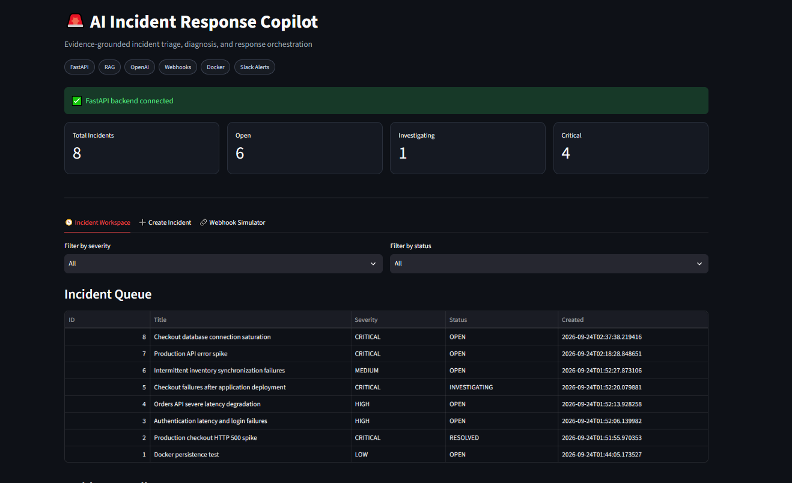
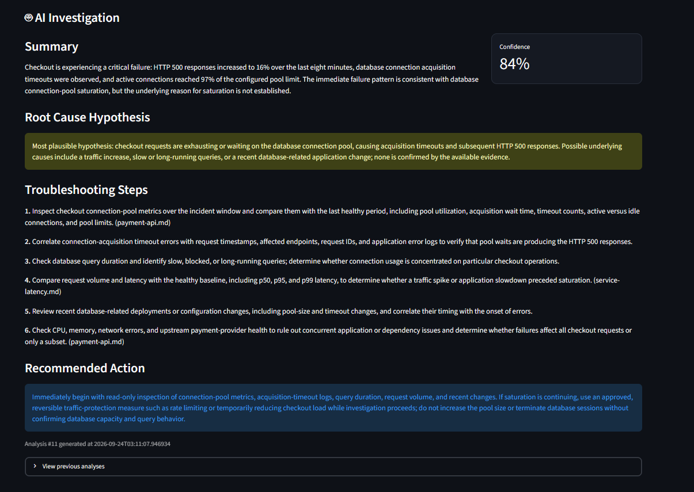
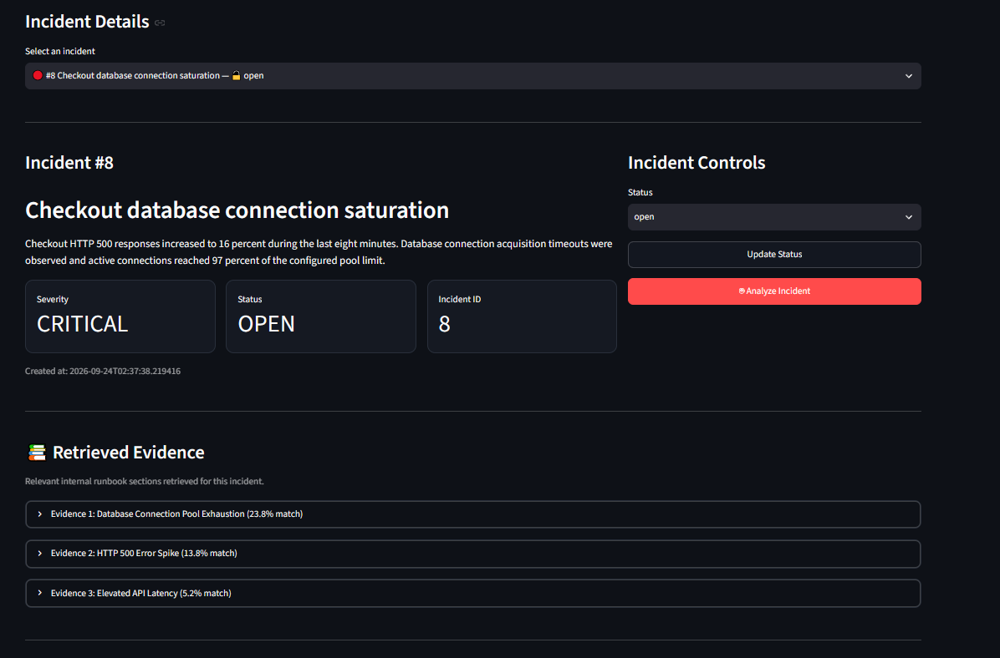
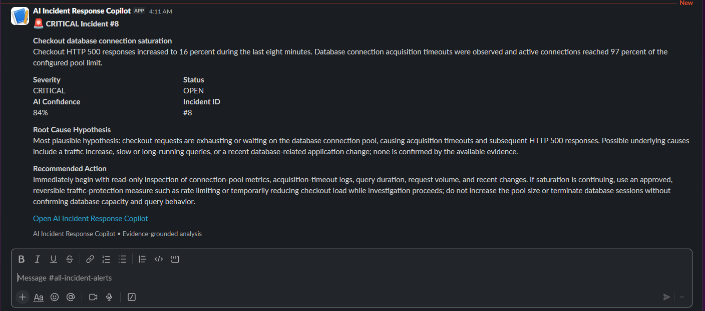

# 🚨 AI Incident Response Copilot


> ⚠️ This project runs locally using Docker. The screenshots below demonstrate the fully working incident-response workflow with AI analysis, RAG evidence retrieval, webhook ingestion, and Slack alerts.

## 🚀 Overview

A production-style AI-assisted incident response platform built with **FastAPI, OpenAI, RAG, Streamlit, Slack, and Docker**.

The system simulates a real operational workflow where monitoring alerts are ingested, analyzed against internal runbooks, stored as incidents, and surfaced to engineers through a dashboard and Slack.

This project demonstrates:

- AI-assisted incident triage
- Evidence-grounded root-cause analysis
- Retrieval-Augmented Generation (RAG)
- Incident lifecycle management
- Monitoring webhook ingestion
- Duplicate alert protection
- Slack incident notifications
- API authentication
- Automated testing
- Docker-based deployment

---

## 🧱 System Architecture

```text
Monitoring / APM
       │
       ▼
Webhook Ingestion
       │
       ▼
FastAPI
       │
       ├──────────────► Incident Database
       │
       ▼
RAG Retrieval
       │
       ▼
Internal Runbooks
       │
       ▼
OpenAI Analysis
       │
       ├──────────────► Streamlit Dashboard
       │
       └──────────────► Slack Alerts
```

---

## 📁 Project Structure

```text
ai-incident-response-copilot/
│
├── app/
│   ├── main.py
│   ├── database.py
│   ├── models.py
│   ├── schemas.py
│   ├── auth.py
│   │
│   ├── routers/
│   │   ├── incidents.py
│   │   └── webhooks.py
│   │
│   └── services/
│       ├── ai_service.py
│       ├── rag_service.py
│       ├── webhook_service.py
│       └── slack_service.py
│
├── docs/
│   └── runbooks/
│       ├── payment-api.md
│       ├── authentication.md
│       └── service-latency.md
│
├── frontend/
│   └── dashboard.py
│
├── scripts/
│   └── simulate_incidents.py
│
├── tests/
│   ├── conftest.py
│   ├── test_incidents.py
│   ├── test_analysis.py
│   ├── test_rag.py
│   └── test_webhooks.py
│
├── images/
├── Dockerfile
├── docker-compose.yml
├── pytest.ini
├── requirements.txt
└── README.md
```

---

## 📊 Incident Operations Dashboard

The Streamlit dashboard provides a centralized incident-response workspace.

### Key Features

- Total / Open / Investigating / Critical incident metrics
- Incident queue
- Severity filtering
- Status filtering
- Incident lifecycle management
- AI analysis controls
- Evidence inspection
- Analysis history



---

## 🤖 AI Incident Investigation

Each incident can be analyzed using the OpenAI Responses API.

The AI returns a structured response containing:

- Incident summary
- Likely root-cause hypothesis
- Confidence score
- Troubleshooting steps
- Recommended action

Example:

```text
Root Cause Hypothesis:
Database connection-pool saturation is a plausible cause.

Confidence:
74%

Recommended Action:
Inspect pool utilization, connection acquisition timeouts,
and long-running database queries before changing configuration.
```

The model is instructed not to invent logs, metrics, or infrastructure details that were not supplied.



---

## 📚 RAG Evidence Retrieval

Before generating an AI diagnosis, the application retrieves relevant internal runbook sections.

Current runbooks cover:

- Payment API failures
- Database connection-pool exhaustion
- Authentication failures
- Authentication latency
- General API latency

Example flow:

```text
Incident Description
        │
        ▼
TF-IDF Search
        │
        ▼
Relevant Runbook Sections
        │
        ▼
OpenAI Analysis
```

The retrieved documents are treated as **investigation guidance**, not proof of a root cause.

This distinction prevents the AI from turning generic documentation into unsupported conclusions.



---

## 📡 Webhook Incident Ingestion

External monitoring systems can create incidents through:

```text
POST /webhooks/incidents
```

Example alert:

```json
{
  "source": "production-apm",
  "external_id": "checkout-alert-001",
  "title": "Checkout database connection saturation",
  "description": "HTTP 500 responses increased while connection acquisition timeouts were observed.",
  "severity": "critical",
  "auto_analyze": true
}
```

Webhook processing includes:

- Shared-secret authentication
- Source tracking
- External event IDs
- Incident creation
- Automatic AI analysis
- Duplicate alert protection

The combination of:

```text
source + external_id
```

is used to prevent duplicate incidents.

---

## 💬 Slack Incident Alerts

High and critical incidents automatically generate Slack notifications.

Alerts include:

- Incident ID
- Severity
- Status
- AI confidence
- Root-cause hypothesis
- Recommended action

Example workflow:

```text
Critical Monitoring Alert
          │
          ▼
      FastAPI
          │
          ▼
      RAG Search
          │
          ▼
     AI Analysis
          │
          ▼
      Slack Alert
```



---

## 🔐 API Security

Incident-management endpoints are protected using:

```text
X-API-Key
```

Monitoring webhook ingestion uses a separate:

```text
X-Webhook-Secret
```

Sensitive credentials such as:

- OpenAI API key
- Slack webhook URL
- Application API key
- Monitoring webhook secret

are stored in `.env` and excluded from Git.

Additional hardening:

- Docker Compose publishes the API and dashboard on `127.0.0.1` only, so they are not reachable from other machines on the same network
- The dashboard container only receives the API key and webhook secret, not the OpenAI key or Slack webhook
- Containers run as a non-root user
- Incident descriptions are capped at 5,000 characters to bound LLM cost per request
- Text sent to Slack is escaped, so alert content cannot inject disguised links or `@channel` mentions
- AI provider errors are logged server-side and never returned to clients

---

## 🐳 Container Infrastructure

The complete application runs using Docker Compose.

Running services:

- FastAPI backend
- Streamlit dashboard
- Persistent SQLite storage

Start the stack:

```bash
docker compose up -d --build
```

Dashboard:

```text
http://localhost:8501
```

FastAPI / Swagger:

```text
http://localhost:8000/docs
```

Health check:

```bash
curl http://localhost:8000/health
```

Expected response:

```json
{
  "status": "ok"
}
```

Stop the stack:

```bash
docker compose down
```

The SQLite database is stored using a persistent Docker volume so incident data survives container restarts.

---

## 🧪 Automated Testing

The backend includes automated tests using `pytest`.

Run:

```bash
python -m pytest -v
```

Current result:

```text
25 passed
```

Tests also run automatically on every push and pull request via GitHub Actions.

Test coverage includes:

- API health
- API authentication
- Incident creation
- Incident retrieval
- Incident updates
- Incident deletion
- Missing incident handling
- RAG retrieval
- Evidence schema
- AI analysis
- Analysis persistence
- Webhook authentication
- Webhook ingestion
- Duplicate event protection (including simultaneous duplicates)
- Cascading deletes and webhook retries after deletion
- Graceful handling of AI provider failures
- Input size limits
- Slack output escaping

OpenAI calls are mocked during testing, so the test suite does not consume API credits.

---

## 🚨 Incident Simulation

A simulation script generates realistic operational incidents.

Run:

```bash
python scripts/simulate_incidents.py
```

Example incidents:

```text
CRITICAL  Production checkout HTTP 500 spike
CRITICAL  Checkout failures after deployment
HIGH      Orders API latency degradation
HIGH      Authentication latency and login failures
MEDIUM    Inventory synchronization failures
```

The scenarios demonstrate how AI confidence changes depending on the evidence available.

---

## ⚙️ How It Works

1. A monitoring system detects an operational issue
2. The monitoring system sends a webhook to FastAPI
3. The webhook secret is validated
4. Duplicate external events are detected
5. A new incident is created
6. Relevant internal runbooks are retrieved
7. Retrieved evidence is supplied to OpenAI
8. OpenAI generates structured incident analysis
9. The analysis is stored in SQLite
10. The dashboard displays the incident and evidence
11. High / critical incidents generate Slack notifications
12. Engineers investigate and update the incident status

---

## 🧠 Evidence-Grounded AI

A key design principle of this project is:

```text
Runbook Guidance
      ≠
Observed Telemetry
      ≠
Confirmed Root Cause
```

The AI is instructed to:

- distinguish facts from hypotheses
- avoid inventing telemetry
- lower confidence when evidence is limited
- prioritize evidence collection
- recommend reversible actions
- avoid declaring an unsupported root cause

This makes the system a **decision-support tool** rather than an autonomous incident-resolution system.

---

## 🧪 Environment

This project was developed and tested locally using:

- Python 3.11
- FastAPI
- SQLAlchemy
- SQLite
- OpenAI Responses API
- scikit-learn
- Streamlit
- Slack Incoming Webhooks
- pytest
- Docker Desktop
- Docker Compose

All screenshots in this repository were captured from the fully working local environment.

---

## 🧠 Skills Demonstrated

- Python backend development
- REST API design
- FastAPI
- SQLAlchemy
- API authentication
- Webhook integrations
- Generative AI integration
- Structured LLM outputs
- Retrieval-Augmented Generation
- Evidence grounding
- Incident-response workflows
- Slack integrations
- Automated testing
- Docker / Docker Compose
- Persistent storage
- Operations dashboard development
- Secure secret handling

---

## ⚠️ Known Limitations

- The Streamlit dashboard has no login of its own. It is meant to run locally; put an authenticating reverse proxy in front of it before exposing it on a network.
- A single shared API key is used; there are no per-user accounts or roles.
- There is no rate limiting on `/incidents/{id}/analyze`, so anyone holding the API key can trigger paid OpenAI calls.
- Incident text is passed to the LLM, so a crafted alert could attempt prompt injection. Output is treated as a suggestion for a human, never executed.
- Retrieval uses TF-IDF keyword matching over a small set of runbooks, not semantic search.
- AI analysis runs synchronously inside the request.

---

## 🔮 Future Improvements

- PostgreSQL
- Semantic embeddings / vector database
- Prometheus integration
- Grafana integration
- Datadog integration
- PagerDuty alerts
- Live metrics and log ingestion
- Background workers for AI analysis
- Rate limiting
- Role-based access control
- Interactive Slack acknowledgement buttons
- Automatic incident postmortems
- Service dependency mapping
- Kubernetes deployment
- Continuous deployment
- Cloud deployment

---

## 👤 Author

**Igor Moreira**

GitHub: [@igornoc](https://github.com/igornoc)

---

## 📌 Project Purpose

This project was built as a practical portfolio demonstration of how modern AI systems can support operational incident response.

The focus is not simply generating AI text, but building a complete workflow around:

```text
Alert
  ↓
Evidence
  ↓
AI Investigation
  ↓
Human Decision
  ↓
Operational Response
```

